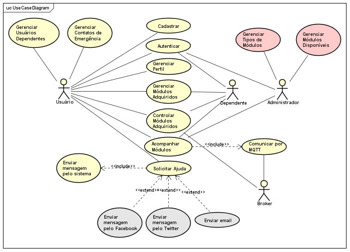
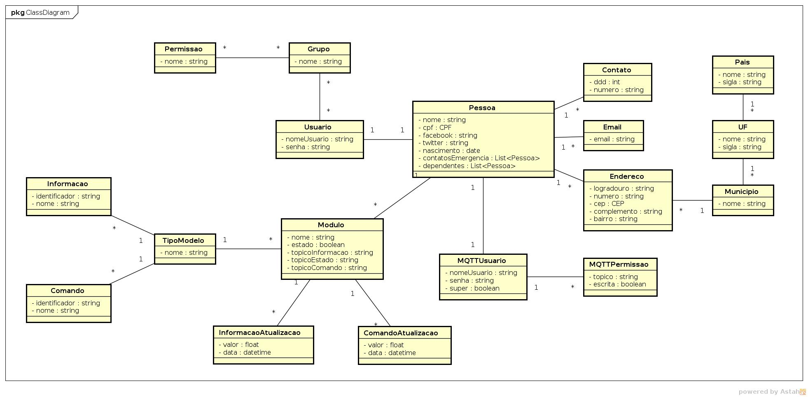

# LUNA

O propósito deste documento é detalhar as necessidades e funcionalidades do projeto Luna, definindo os requisitos funcionais e não-funcionais, o diagrama de caso de uso e especificando as ações dos usuários no sistema, de modo que venha a facilitar o entendimento e a interação entre todos os participantes/desenvolvedores do projeto, assim como os registros das tomadas de decisões entre o grupo e o registro das delegações das atividades de cada um dos envolvidos e suas respectivas participações.

## Escopo

O projeto Luna visa o desenvolvimento de uma assistente pessoal interativo que permitirá ao usuário controlar módulos eletrônicos da casa, escritório ou até mesmo de um ambiente hospitalar através de um aplicativo desenvolvido para sistemas móveis de comunicação (smartphones e tablets) ou pela web por meio dos navegadores de internet (computadores e notebooks).

## Requisitos

### Requisitos Funcionais

<table>
  <tr>
    <td>Cod.</td>
    <td>Nome</td>
    <td>Descrição</td>
    <td>Categoria</td>
  </tr>
  <tr>
    <td>F01</td>
    <td>Gerenciar módulos e tipos de módulos</td>
    <td>Administrador deve ser capaz de cadastrar os módulos desenvolvidos para quando o usuário realizar cadastro, ativar os módulos já cadastrados.</td>
    <td>Evidente</td>
  </tr>
  <tr>
    <td>F02</td>
    <td>Cadastro de Usuário</td>
    <td>Usuário realiza seu cadastro com informações básicas e ativa os módulos que possui.</td>
    <td>Evidente</td>
  </tr>
  <tr>
    <td>F03</td>
    <td>Ativar/Desativar Módulo</td>
    <td>Usuário deve ser capaz de ativar o módulo pelo código na embalagem e desativar posteriormente.</td>
    <td>Evidente</td>
  </tr>
  <tr>
    <td>F04</td>
    <td>Acompanhar Módulos</td>
    <td>Usuário deve ser capaz de acompanhar os módulos.</td>
    <td>Evidente</td>
  </tr>
  <tr>
    <td>F05</td>
    <td>Controlar Módulos</td>
    <td>Usuário deve ser capaz de controlar os módulos.</td>
    <td>Evidente</td>
  </tr>
  <tr>
    <td>F06</td>
    <td>Gerenciar Dependentes</td>
    <td>Usuário pode adicionar dependentes para acompanhamento e 
controle dos módulos.</td>
    <td>Evidente</td>
  </tr>
  <tr>
    <td>F07</td>
    <td>Solicitar Ajuda</td>
    <td>Usuário pode enviar mensagens (interface web, aplicativo, e-mail, Twitter e/ou
Facebook) para dependentes e contatos de emergência.</td>
    <td>Evidente</td>
  </tr>
  <tr>
    <td>F08</td>
    <td>Gerenciar Contatos de Emergência</td>
    <td>Usuário deve ser capaz de gerenciar uma lista de contatos (e-mail, Twitter, Facebook) de emergência (F07).</td>
    <td>Evidente</td>
  </tr>
</table>

### Requisitos Não-Funcionais

<table>
  <tr>
    <td>Cod.</td>
    <td>Nome</td>
    <td>Descrição</td>
    <td>Categoria</td>
  </tr>
  <tr>
    <td>NF01</td>
    <td>Interface por Voz</td>
    <td>O sistema deve ser capaz de reconhecer comandos e se
comunicar por voz.</td>
    <td>Obrigatório</td>
  </tr>
  <tr>
    <td>NF02</td>
    <td>Acompanhamento em tempo real</td>
    <td>O sistema deve atualizar a interface conforme novos comandos são realizados.</td>
    <td>Obrigatório</td>
  </tr>
  <tr>
    <td>NF03</td>
    <td>Módulos Únicos</td>
    <td>Cada módulo deve ter um código único (que será utilizado para identificação, ativação e tópicos).</td>
    <td>Obrigatório</td>
  </tr>
  <tr>
    <td>NF04</td>
    <td>Comunicação MQTT</td>
    <td>O sistema deve realizar a comunicação entre o usuário e os módulos utilizando o protocolo MQTT.</td>
    <td>Obrigatório</td>
  </tr>
  <tr>
    <td>NF05</td>
    <td>Acessibilidade</td>
    <td>O sistema deve seguir as convenções e normas de acessibilidade.</td>
    <td>Desejável</td>
  </tr>
</table>

### Tabela de Referência dos Requisitos

<table>
  <tr>
    <td></td>
    <td>NF01</td>
    <td>NF02</td>
    <td>NF03</td>
    <td>NF04</td>
    <td>NF05</td>
  </tr>
  <tr>
    <td>F01</td>
    <td></td>
    <td></td>
    <td>X</td>
    <td></td>
    <td>X</td>
  </tr>
  <tr>
    <td>F02</td>
    <td>X</td>
    <td></td>
    <td></td>
    <td></td>
    <td>X</td>
  </tr>
  <tr>
    <td>F03</td>
    <td>X</td>
    <td>X</td>
    <td>X</td>
    <td></td>
    <td>X</td>
  </tr>
  <tr>
    <td>F04</td>
    <td>X</td>
    <td>X</td>
    <td></td>
    <td>X</td>
    <td>X</td>
  </tr>
  <tr>
    <td>F05</td>
    <td>X</td>
    <td>X</td>
    <td>X</td>
    <td>X</td>
    <td>X</td>
  </tr>
  <tr>
    <td>F06</td>
    <td>X</td>
    <td></td>
    <td></td>
    <td></td>
    <td>X</td>
  </tr>
  <tr>
    <td>F07</td>
    <td>X</td>
    <td>X</td>
    <td></td>
    <td></td>
    <td>X</td>
  </tr>
  <tr>
    <td>F08</td>
    <td>X</td>
    <td></td>
    <td></td>
    <td></td>
    <td>X</td>
  </tr>
</table>

### Casos de Uso

Leia a [Especificação dos Casos de Uso](especificacao-casos-de-uso.md).

#### Tabela de Casos de Uso

<table>
  <tr>
    <td>Cod.</td>
    <td>Caso de Uso</td>
    <td>Descrição</td>
    <td>Classificação</td>
  </tr>
  <tr>
    <td>UC01</td>
    <td>Gerenciar Perfil</td>
    <td>O usuário pode editar suas informações pessoais e salvando-as no sistema.</td>
    <td>Primário</td>
  </tr>
  <tr>
    <td>UC02</td>
    <td>Gerenciar Usuários Dependentes</td>
    <td>O usuário visualiza, adiciona ou remove usuários dependentes enviando uma solicitação de vínculo.</td>
    <td>Primário</td>
  </tr>
  <tr>
    <td>UC03</td>
    <td>Gerenciar Contatos de Emergência</td>
    <td>O usuário visualiza, adiciona ou remove contatos de emergência que podem ser alertados automaticamente via email, mensagem no Facebook ou Twitter</td>
    <td>Primário</td>
  </tr>
  <tr>
    <td>UC04</td>
    <td>Gerenciar Módulos Adquiridos</td>
    <td>O usuário ou dependente cadastra, altera ou remove seus módulos adquiridos.</td>
    <td>Primário</td>
  </tr>
  <tr>
    <td>UC05</td>
    <td>Controlar Módulos Adquiridos</td>
    <td>O usuário ou dependente pode ativar e desativar os módulos.</td>
    <td>Primário</td>
  </tr>
  <tr>
    <td>UC06</td>
    <td>Acompanhar Módulos</td>
    <td>O usuário visualiza através de um painel o estado dos módulos.</td>
    <td>Primário</td>
  </tr>
  <tr>
    <td>UC07</td>
    <td>Solicitar Ajuda</td>
    <td>Em caso de emergência o usuário envia uma mensagem para os contatos de emergência cadastrados, assim, solicitando ajuda.</td>
    <td>Secundário</td>
  </tr>
  <tr>
    <td>UC08</td>
    <td>Enviar mensagem pelo sistema</td>
    <td>Em decorrência do UC07, o sistema deve enviar uma mensagem notificando os dependentes cadastrados.</td>
    <td>Secundário</td>
  </tr>
  <tr>
    <td>UC09</td>
    <td>Enviar mensagem por email</td>
    <td>Em decorrência do UC07, o sistema deve enviar um email para os dependentes e contatos de emergência.</td>
    <td>Terciário</td>
  </tr>
  <tr>
    <td>UC10</td>
    <td>Enviar mensagem por Facebook</td>
    <td>Em decorrência do UC07, o sistema deve enviar mensagem por Facebook para os dependentes e contatos de emergência.</td>
    <td>Terciário</td>
  </tr>
  <tr>
    <td>UC11</td>
    <td>Enviar mensagem por Twitter</td>
    <td>Em decorrência do UC07, o sistema deve enviar uma mensagem por Twitter para os dependentes e contatos de emergência.</td>
    <td>Terciário</td>
  </tr>
  <tr>
    <td>UC12</td>
    <td>Gerenciar Tipos de Módulos</td>
    <td>O administrador visualiza, altera, adiciona ou remove tipos de módulos no sistema.</td>
    <td>Primário</td>
  </tr>
  <tr>
    <td>UC13</td>
    <td>Gerenciar Módulos Disponíveis</td>
    <td>O administrador gerencia os módulos disponíveis para serem adquiridos pelos usuários.</td>
    <td>Primário</td>
  </tr>
  <tr>
    <td>UC14</td>
    <td>Comunicar por MQTT</td>
    <td>O sistema deve trocar mensagens com o Broker afim de realizar a comunicação entre o usuário e os módulos.</td>
    <td>Primário</td>
  </tr>
  <tr>
    <td>UC15</td>
    <td>Inscrever usuários no Broker </td>
    <td>O sistema deve inscrever os usuários autenticados para receber notificações de mudanças de estado do Broker.</td>
    <td>Primário</td>
  </tr>
</table>

#### Tabela de Referência dos Casos de Uso X Requisitos

<table>
  <tr>
    <td></td>
    <td>NF01</td>
    <td>NF02</td>
    <td>NF03</td>
    <td>NF04</td>
    <td>NF05</td>
  </tr>
  <tr>
    <td>UC01</td>
    <td>X</td>
    <td></td>
    <td></td>
    <td></td>
    <td>X</td>
  </tr>
  <tr>
    <td>UC02</td>
    <td>X</td>
    <td></td>
    <td></td>
    <td></td>
    <td>X</td>
  </tr>
  <tr>
    <td>UC03</td>
    <td>X</td>
    <td></td>
    <td></td>
    <td></td>
    <td>X</td>
  </tr>
  <tr>
    <td>UC04</td>
    <td>X</td>
    <td></td>
    <td>X</td>
    <td></td>
    <td>X</td>
  </tr>
  <tr>
    <td>UC05</td>
    <td>X</td>
    <td>X</td>
    <td>X</td>
    <td>X</td>
    <td>X</td>
  </tr>
  <tr>
    <td>UC06</td>
    <td>X</td>
    <td></td>
    <td></td>
    <td>X</td>
    <td>X</td>
  </tr>
  <tr>
    <td>UC07</td>
    <td>X</td>
    <td>X</td>
    <td></td>
    <td></td>
    <td>X</td>
  </tr>
  <tr>
    <td>UC08</td>
    <td></td>
    <td></td>
    <td></td>
    <td>X</td>
    <td>X</td>
  </tr>
  <tr>
    <td>UC09</td>
    <td></td>
    <td></td>
    <td></td>
    <td></td>
    <td>X</td>
  </tr>
  <tr>
    <td>UC10</td>
    <td></td>
    <td></td>
    <td></td>
    <td></td>
    <td></td>
  </tr>
  <tr>
    <td>UC11</td>
    <td></td>
    <td></td>
    <td></td>
    <td></td>
    <td></td>
  </tr>
  <tr>
    <td>UC12</td>
    <td></td>
    <td></td>
    <td></td>
    <td></td>
    <td>X</td>
  </tr>
  <tr>
    <td>UC13</td>
    <td></td>
    <td></td>
    <td>X</td>
    <td></td>
    <td>X</td>
  </tr>
  <tr>
    <td>UC14</td>
    <td></td>
    <td>X</td>
    <td>X</td>
    <td>X</td>
    <td>X</td>
  </tr>
  <tr>
    <td>UC15</td>
    <td></td>
    <td>X</td>
    <td>X</td>
    <td>X</td>
    <td>X</td>
  </tr>
</table>

#### Atores

<table>
  <tr>
    <td>Ator</td>
    <td>Descrição</td>
  </tr>
  <tr>
    <td>Administrador</td>
    <td>Caracteriza responsável pelo sistema e pelos módulos.</td>
  </tr>
  <tr>
    <td>Usuário</td>
    <td>Caracteriza o usuário principal do sistema/assistente.</td>
  </tr>
  <tr>
    <td>Dependente</td>
    <td>Caracteriza usuários dependentes de outros usuários.</td>
  </tr>
  <tr>
    <td>Sistema</td>
    <td>Caracteriza o responsável pelas ações realizadas internamente pelo próprio sistema.</td>
  </tr>
  <tr>
    <td>Broker</td>
    <td>Caracteriza o responsável pelas ações realizadas pelo broker MQTT.</td>
  </tr>
</table>

### Diagrama Entidade-Relacionamento

### Modelo de Domínio

